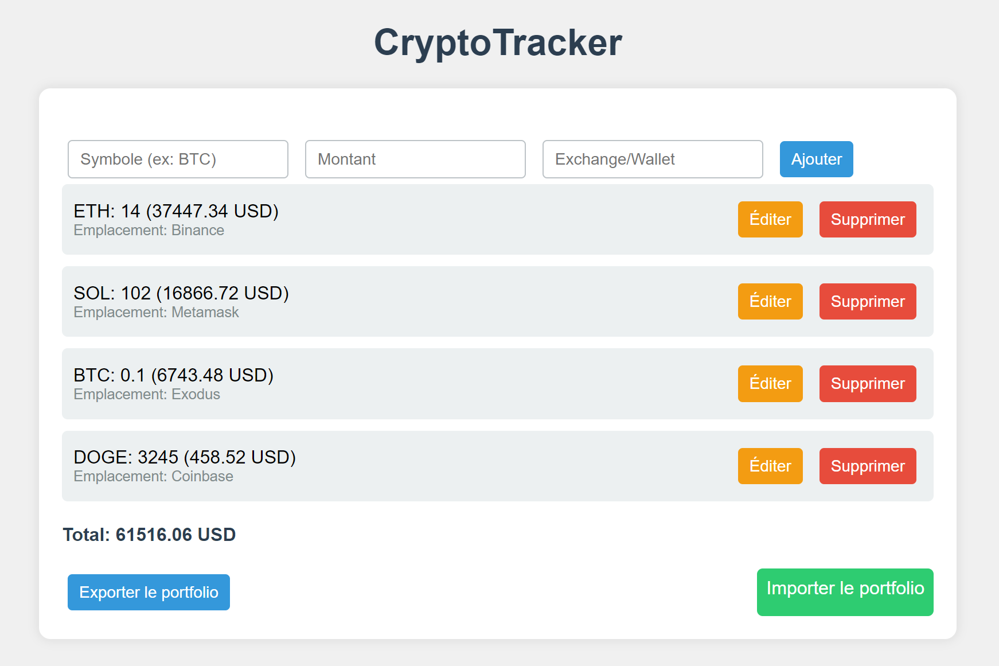

# CryptoPortfolio

CryptoPortfolio est une application web qui vous permet de suivre vos investissements en cryptomonnaies. Vous pouvez ajouter, modifier et supprimer des cryptomonnaies de votre portefeuille, ainsi que sauvegarder et restaurer vos données.



## Fonctionnalités

- Ajouter des cryptomonnaies avec leur symbole, montant et emplacement (exchange ou wallet).
- Modifier les informations d'une cryptomonnaie existante.
- Supprimer des cryptomonnaies de votre portefeuille.
- Afficher la valeur totale de votre portefeuille en USD.
- Sauvegarder votre portefeuille en tant que fichier JSON.
- Restaurer votre portefeuille à partir d'un fichier JSON.

## Technologies utilisées

- HTML
- CSS
- JavaScript
- API CryptoCompare pour récupérer les prix des cryptomonnaies

## Installation

1. Clonez le dépôt sur votre machine locale :
   ```bash
   git clone https://github.com/votre-utilisateur/CryptoTracker.git
   ```

2. Ouvrez le fichier `CryptoTracker.html` dans votre navigateur.

## Utilisation

1. Entrez le symbole de la cryptomonnaie (ex: BTC), le montant et l'emplacement dans les champs appropriés.
2. Cliquez sur "Ajouter" pour ajouter la cryptomonnaie à votre portefeuille.
3. Vous pouvez modifier ou supprimer des cryptomonnaies en utilisant les boutons correspondants.
4. Utilisez les boutons "Exporter le portfolio" et "Importer le portfolio" pour sauvegarder et restaurer vos données.

## Contribuer

Les contributions sont les bienvenues ! Si vous souhaitez contribuer à ce projet, veuillez suivre ces étapes :

1. Fork le projet.
2. Créez une nouvelle branche (`git checkout -b feature/YourFeature`).
3. Effectuez vos modifications et validez (`git commit -m 'Ajout d'une nouvelle fonctionnalité'`).
4. Poussez vos modifications (`git push origin feature/YourFeature`).
5. Ouvrez une Pull Request.

## Auteurs

- Votre Nom - [Votre Profil GitHub](https://github.com/votre-utilisateur)

## License

Ce projet est sous licence MIT - voir le fichier [LICENSE](LICENSE) pour plus de détails.
